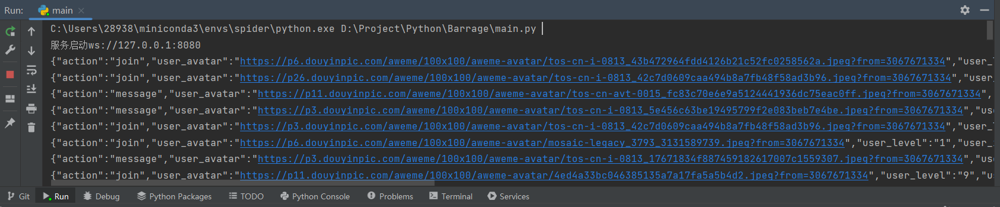

# Barrage 

Barrage 为从[DouYinBot](https://github.com/lkkings/DouYinBot)分离出来的项目，用于爬取抖音弹幕并实现自动回复的工具。

## 安装依赖

为了运行 Barrage 项目，你需要安装以下依赖：

- Python 3.x
- Chrome 浏览器 
- [ChromeDriver](https://sites.google.com/chromium.org/driver/)：请根据你的 Chrome 浏览器版本下载合适的 ChromeDriver 并将其放置在项目文件夹中，或更改自己的环境变量 ```os.environ['CHROME_DRIVER']="/path/to/chromedriver.exe"```。

## 使用方法

1. 克隆或下载项目到本地计算机。
2. cd Barrage
3. pip install -r requirements.txt
4. python main.py

## 运行截图

